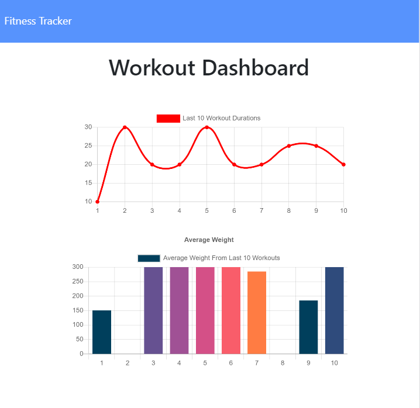
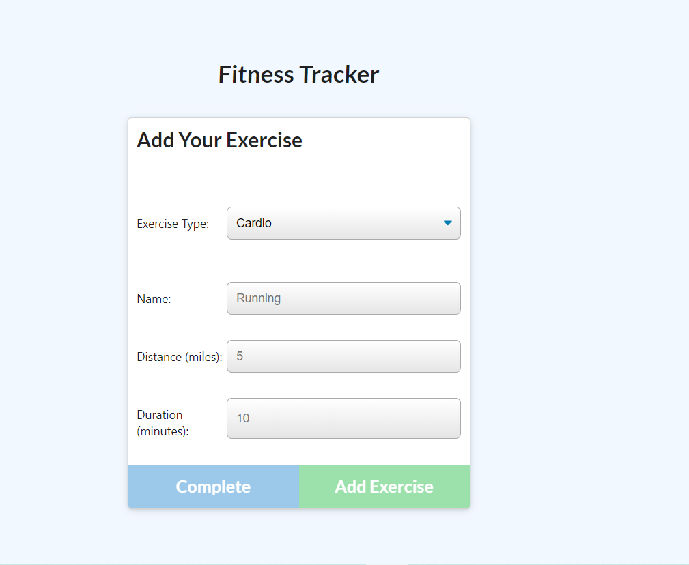
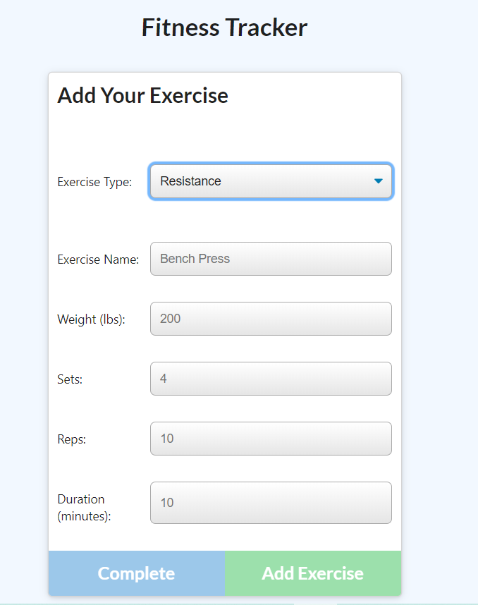
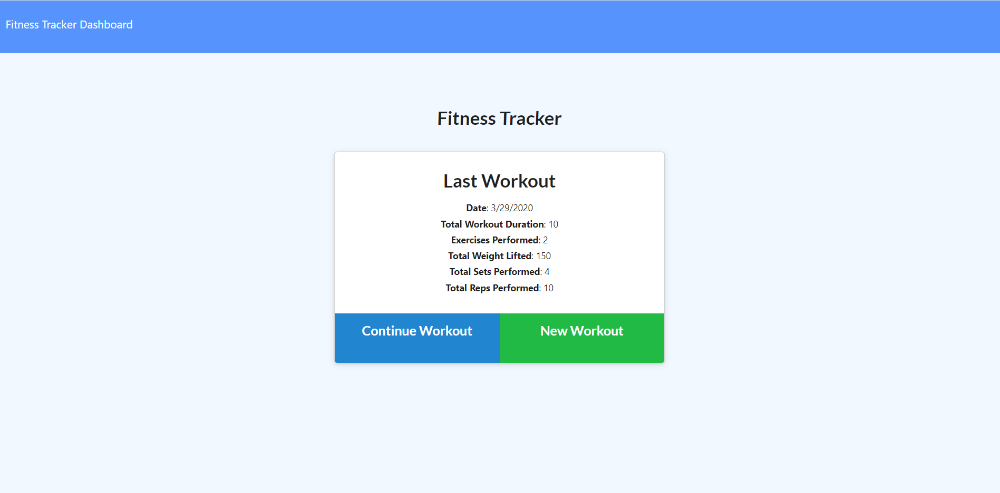

# Workout-Tracker


## Table of contents
- [General Info](#Info)
- [Install](#Install)
- [Dependencies](#Dependencies)
- [Technologies](#Technologies)
- [Demo](#Demo)
- [Author](#Author)
- [License](#License)


# General Info
- Workout-Tracker application tracks the user's exercise routine and outputs the result using charts (graphs).

#### Build With: 
- Workout-Tracker application is build with Mongo database, a Mongoose schema and handle routes with Express using HTML, CSS, JavaScript and jQuery.
#### Goal: 
- The overall goal of this project is to design the back-end logic in order for the front-end to display exercise results. 

#### App Overview:


- Users can view the stats (results) on their past 10 workouts.



- Users can input info on the type of exercise (ie. Cardio). Setting up the distance and duration of the exercise and adding it to the application.



- User also can enter information like sets and reps for Resistance type.


# User Story: 
- As a user, I want to be able to view create and track daily workouts. I want to be able to log multiple exercises in a workout on a given day. I should also be able to track the name, type, weight, sets, reps, and duration of exercise. If the exercise is a cardio exercise, I should be able to track my distance traveled.

# Business Context
- A consumer will reach their fitness goals quicker when they track their workout progress.

# Install

To run the application locally, follow these steps:

1. Fork the repository and open it in VS Code or any local coding application.
2. Install dependencies:

```javascript
npm i install

npm i express

npm i mongoose

npm i morgan

```
3. In your teminal run the following to deploy

```javascript
node server.js
```
# Dependencies 
```javascript

{
  "name": "workout-tracker",
  "version": "1.0.0",
  "description": "",
  "main": "server.js",
  "scripts": {
    "start": "node server.js",
    "watch": "nodemon server.js",
    "seed": "node seeders/seed.js",
    "test": "echo \"Error: no test specified\" && exit 1"
  },
  "repository": {
    "type": "git",
    "url": "git+https://github.com/ethanlloyd21/Workout-Tracker.git"
  },
  "author": "",
  "license": "ISC",
  "dependencies": {
    "chart.js": "^2.9.3",
    "express": "^4.17.1",
    "mongodb": "^3.5.5",
    "mongoose": "^5.9.6",
    "morgan": "^1.10.0"
  }
}

```

# Technologies
- MongoDB
- Mongoose
- Express
- Chart.js
- JavaScript
- HTML5
- CSS
- jQuery 

# Demo
<a target="_blank" rel="noopener noreferrer" href="https://drive.google.com/file/d/1fOzNEoUijjSD_r_xigmhTvubNVEDjY-j/view">  </a>

- <a target="_blank" rel="noopener noreferrer" href="https://drive.google.com/file/d/1fOzNEoUijjSD_r_xigmhTvubNVEDjY-j/view"> Click </a> on the image above for a video demo of the application.
- ----> https://workout-tracker-mongodb.herokuapp.com/ <---- click here to check out the deployement on heroku.


# Author
- Lloyd Marcelino 
- github: https://github.com/ethanlloyd21
- website: lloydmarcelino.com
- email: lloydmarcelino@gmail.com

# License 
- see MIT License Copyright (c) 2020
